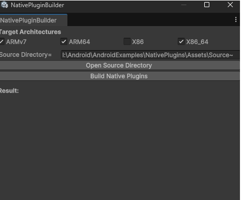

# Native Plugin Builder

## Description

Shows how to compile native c/cpp files into a shared library (libnative.so) for different architectures using ndk-build and use that native shared library from C# script.

## Requirements

* Unity 6.0 or higher

### Quick Steps:
* Open the project 
* NativePluginBuilder window should open, if it's not opened, from main menu go to Plugins->Build.
* Select desired architectures, for ex., ARMv7 and ARM64
* Click Build Native Plugins
* If all good, it should say **Result: Success**, the native plugins should be copied to Assets/Plugins/[abi], and appropriate plugin settings (like CPU) should be set
* Select Il2Cpp in Player Settings
* Pick the desired Android Architectures from Player Settings
* Build & Run
* If all good, on Android device you should see 
		Result is = 13
* That means C# called **add** function from shared library you've produced.