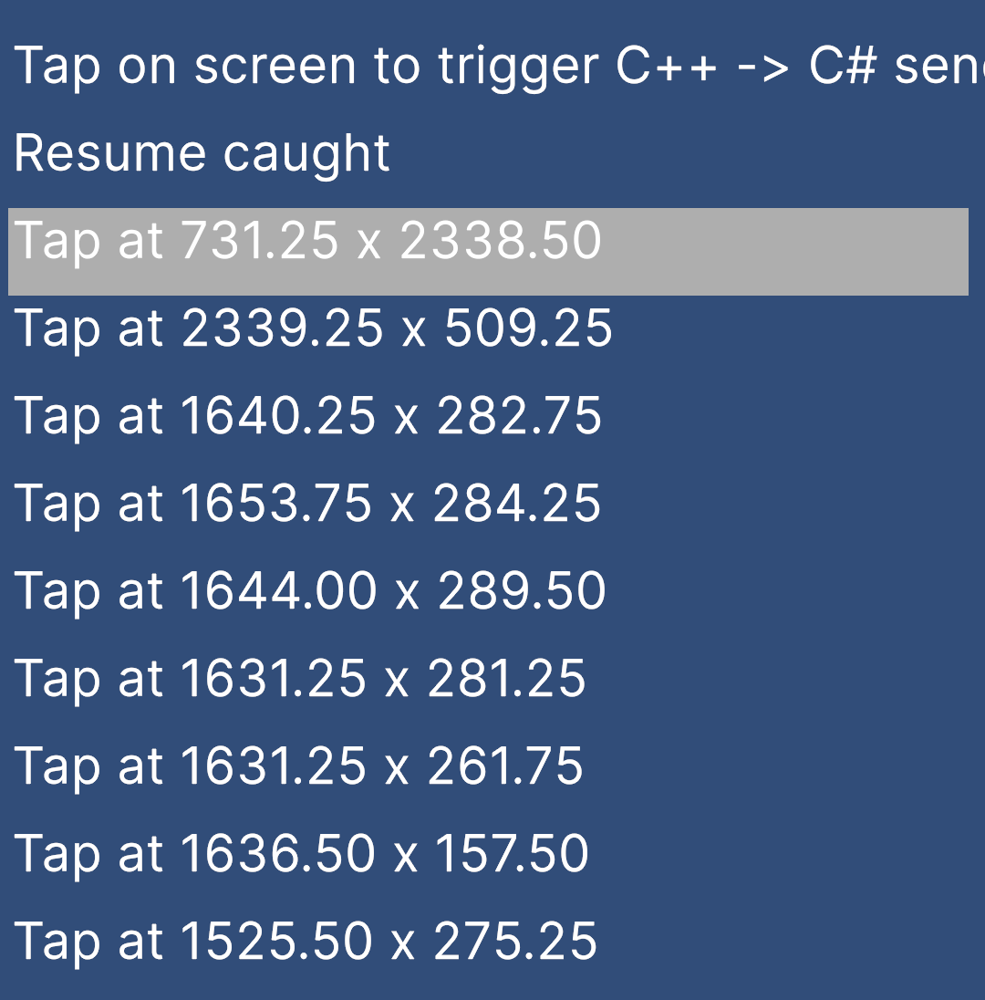

## Extending GameActivity Bridge

Shows how to expand GameActivity C++ bridge files.

Unity doesn't provide a way to add additional C++ files into GameActivity (libgame.so), thus this project uses 
**Assets\Editor\PostProcessor.cs** to copy **ExtraSourceFiles** contents to <gradle_project>\unityLibrary\src\main\cpp\GameActivity\CustomFolder\.

Check MyFile.cpp, it does few things:
* Register to GameActivity's input event, and call **SendMessage** whenever touch event is down
* Register to GameActivity's resume event, and call **SendMessage** whenever app is resumed

Quick Steps
* Open Unity project
* Build & Run
* Tap on screen, "Tap at X x Y" should appear on the screen
* Pause/Resume app, "Resume caught" should appear on the screen

You can register to variaty of things in GameActivity native bridge, and peform a custom logic.

Check unityLibrary\src\main\cpp\GameActivity\UGAEvents.h for full list of available events.