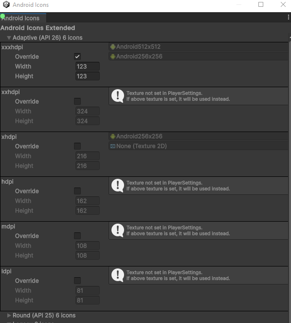

## Android Icons with overridable sizes

This project provides utility code which enables you to override Unity's predefines sizes for icons.

Quick Steps
* Copy all AndroidIcons*.cs files from Assets/Editor to your project's Assets/Editor folder
* Open your project, there will be a menu Window->Android->Icons
* Select Override for icon sizes you want to override, and set the new size
* Produce the build

**Note:** Be sure to manually validate gradle project folder in 'launcher\src\main\res'.
**Note:** The intermediate gradle project is stored in < UnityProject >\Library\Bee\Android\Prj folder.