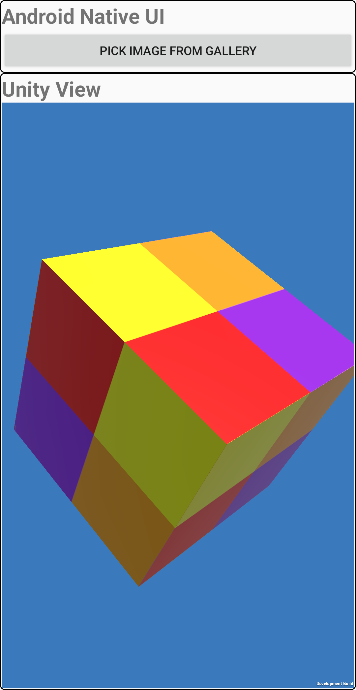

# Android Examples

## Native Plugins

Shows how to compile native c/cpp files into a shared library for different architectures and use it from C# script

Quick Steps:
* Install Unity with Android Support (I used 2019.4.32)
	* Note: Google tools have a limitation that NDK path shouldn't contain any whitespaces. Either install Unity into a path with no whi
* Open the project 
* NativePluginBuilder window should open, if it's not opened, from main menu go to Plugins->Build.
* Select desired architectures, for ex., ARMv7 and ARM64
* Click Build Native Plugins
* If all good, it should say **Result: Success**, the native plugins should be copied to Assets/Plugins/[abi], and appropriate plugin settings (like CPU) should be set
* Select Il2Cpp in Player Settings
* Pick the desired Android Architectures from Player Settings
* Build & Run
* If all good, on Android device you should see 

		adding 3 and 10 in native code equals 13

## PluginResUpgrader
* Starting with Unity 2021.2, if you have Assets/Plugins/Android/res folder you'll get an error:

 **OBSOLETE - Providing Android resources in Assets/Plugins/Android/res was removed, please move your resources to an AAR or an Android Library. See "AAR plug-ins and Android Libraries" section of the Manual for more details.**

 * The project provide a simple upgrader for this issue, if you using .aar or .androidlib plugins is not an option
 * Simply move **PluginResUpgrader/Assets/Editor/AndroidResUpgrader.cs** into your project Assets/Editor folder.
 * Restart Editor
 * Dialog will show up asking if you want to upgrade, upon choosing Yes:
     * Unity will copy Assets/Plugins/Android/res into Assets/Plugins/Android/res-legacy
     * Upon building to Android, the script will manually copy contents of Assets/Plugins/Android/res-legacy to <gradle_project>unityLibrary/src/main/res folder.

| **Name**    | **Description** | **Image** | **Unity Version** |
| :--- | :--- | :--- | :--- |
| [Gallery Browser](/Docs/GalleryBrowser.md) | Shows how to access an image from phone's gallery via Android native UI and pass it to Unity. **Note:** Unity view only occupies part of the application window. |    | Unity 6.0
