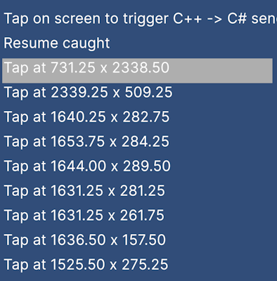

## Welcome to Android Examples for Unity

My name is Tomas Dirvanauskas and I am part of Unity's Android development team. This repository contains small examples showing how you can extend Unity's Android platform.

## Examples

| **Name**    | **Description** | **Image** | **Unity Version** |
| :--- | :--- | :--- | :--- |
| [Plugin Res Upgrader](/PluginUpgrader/README.md) | Provides an upgrade path for res/assets folders located in Assets/Plugins/Android folder to be continued to be copied to gradle project. | | Unity 2021.3 and higher |
| [Native Plugin Builder](/NativePluginBuilder/README.md) | Shows how to compile native c/cpp files into a shared library (libnative.so) for different architectures using ndk-build and use that native shared library from C# script. |  | Unity 6.0 |
| [Icons Extended](/IconsExtended/README.md) | Shows how to access an image from phone's gallery via Android native UI and pass it to Unity. **Note:** Unity view only occupies part of the application window. |   | Unity 2021.3 or higher |
| [Gallery Browser](/GalleryBrowser/README.md) | Shows how to access an image from phone's gallery via Android native UI and pass it to Unity. **Note:** Unity view only occupies part of the application window. |   | Unity 6.0 |
| [Extending GameActivity](/GameActivityExpandingBridge/README.md) | Shows how to expand GameActivity C++ bridge files. |   | Unity 6.0 |
| [Java Native Interface](/JavaNativeInterface/README.md) | Shows how to use [AndroidJavaClass](https://docs.unity3d.com/ScriptReference/AndroidJavaClass.html)/[AndroidJavaObject](https://docs.unity3d.com/ScriptReference/AndroidJavaObject.html) classes||Unity 6.0 |